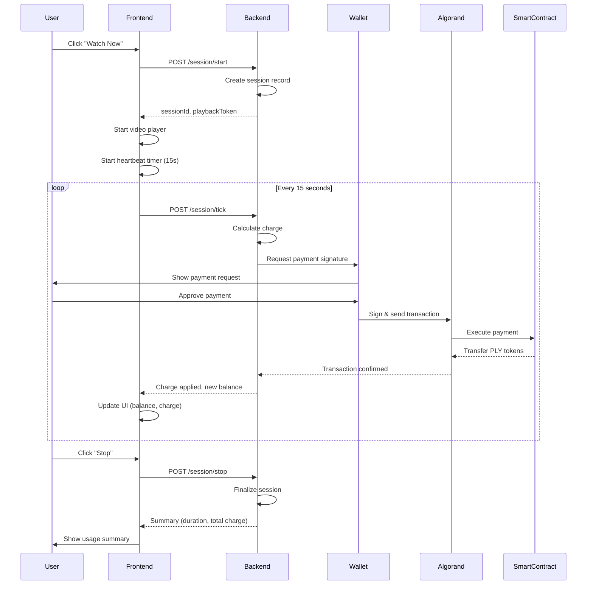
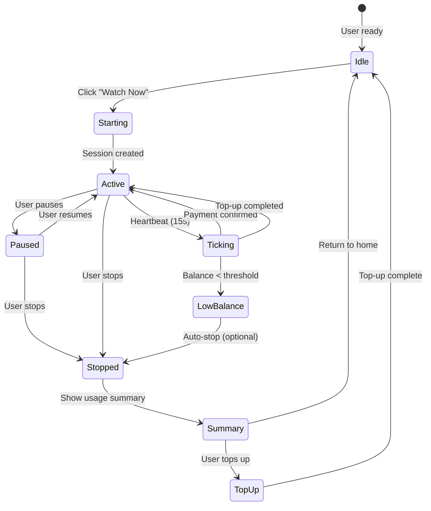
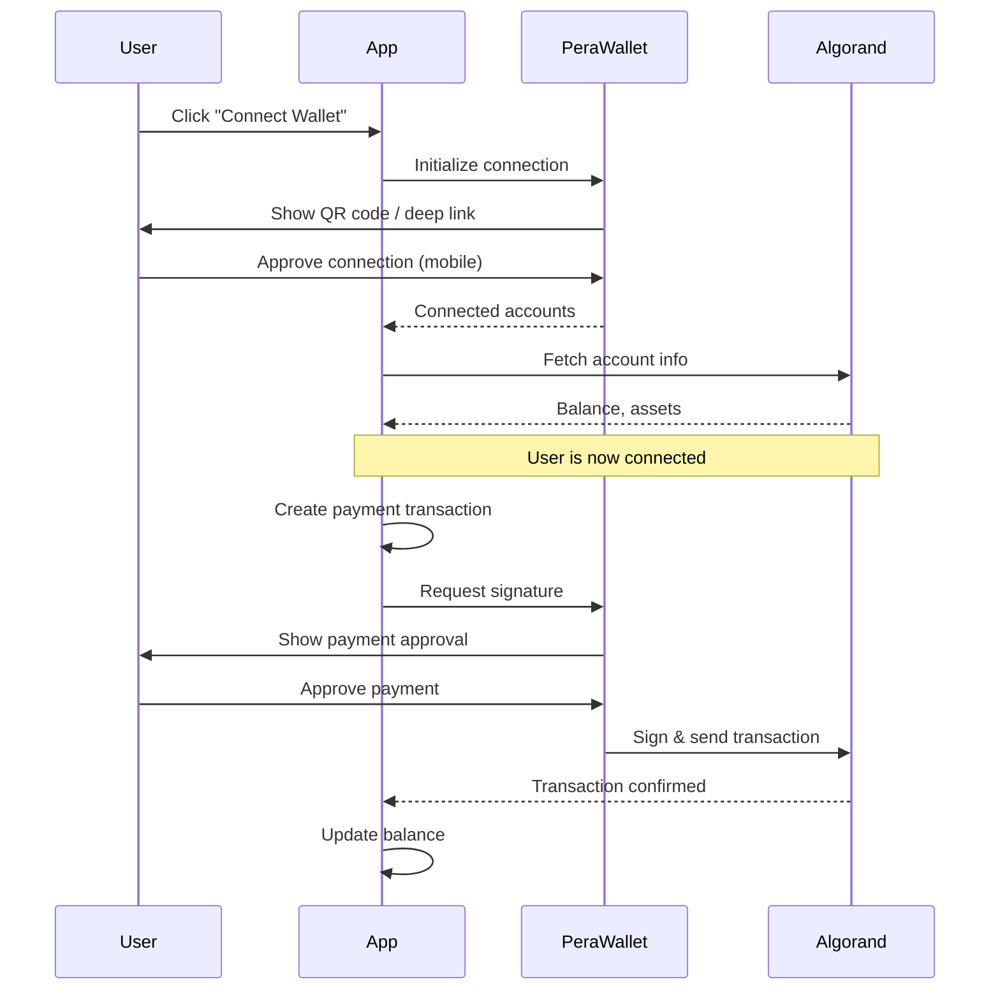
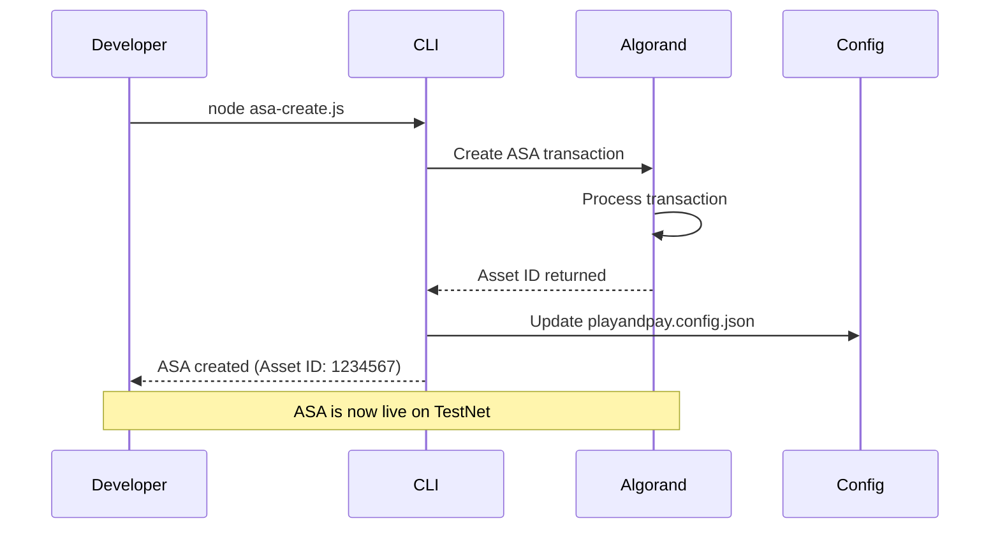
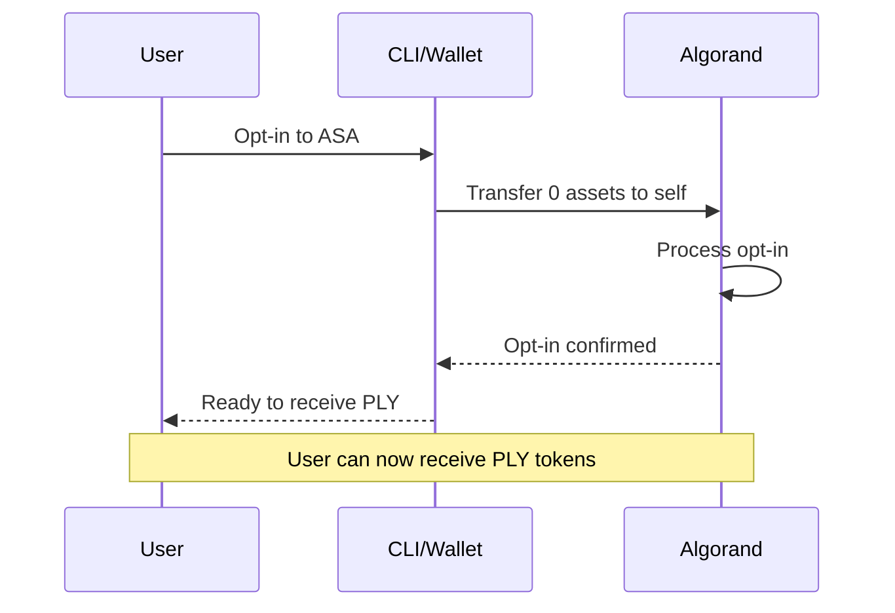

# 🔄 Play and Pay - Flow Diagrams & Operational Notes

**پروژه:** Pay as Play  
**تاریخ ایجاد:** 2025-11-04  
**آخرین به‌روزرسانی:** 2025-11-04  
**ورژن:** 1.0

---

## 📋 فهرست

- [User Payment Flow](#user-payment-flow)
- [Session Management Flow](#session-management-flow)
- [Wallet Connect Flow](#wallet-connect-flow)
- [ASA Creation & Opt-in Flow](#asa-creation--opt-in-flow)
- [Operational Notes](#operational-notes)

---

## 🎬 User Payment Flow

### Sequence Diagram



### Key Points

1. **Session Start:** Backend creates session, returns sessionId
2. **Heartbeat Loop:** Every 15 seconds, frontend sends tick
3. **Payment:** User signs transaction via wallet (not server)
4. **Confirmation:** Algorand confirms, backend updates balance
5. **Session Stop:** Final summary with total charge

---

## 🎮 Session Management Flow

### State Diagram



### Session States

- **Idle:** User browsing, no active session
- **Starting:** Session creation in progress
- **Active:** Video playing, billing active
- **Ticking:** Heartbeat sent, payment processing
- **Paused:** User paused, billing paused
- **LowBalance:** Balance below threshold
- **Stopped:** Session ended
- **Summary:** Showing usage summary

---

## 🔐 Wallet Connect Flow

### Connection Sequence



### Security Benefits

- ✅ **No Server-Side Keys:** User signs with their wallet
- ✅ **User Control:** User approves every transaction
- ✅ **Transparency:** All transactions visible on blockchain
- ✅ **Security:** Private keys never leave user's device

---

## 🪙 ASA Creation & Opt-in Flow

### Creation Process



### Opt-in Process



### Steps for Developers

1. **Create ASA:**
   ```bash
   CREATOR_MNEMONIC="..." node asa-create.js
   ```

2. **Update Config:**
   ```json
   {
     "asa_id": "1234567"
   }
   ```

3. **Opt-in Users:**
   ```bash
   USER_MNEMONIC="..." ASA_ID=1234567 node opt-in.js
   ```

4. **Opt-in Providers:**
   ```bash
   PROVIDER_MNEMONIC="..." ASA_ID=1234567 node opt-in.js
   ```

---

## 📝 Operational Notes

### Development Workflow

#### 1. Setup TestNet Environment

```bash
# Install dependencies
npm install algosdk dotenv

# Create .env file
CREATOR_MNEMONIC="your 25-word mnemonic"
USER_MNEMONIC="user test mnemonic"
PROVIDER_MNEMONIC="provider test mnemonic"
ASA_ID=1234567
```

#### 2. Create ASA (One-time)

```bash
# Run ASA creation script
CREATOR_MNEMONIC="..." node asa-create.js

# Output:
# Asset ID: 1234567
# Unit: PLY
# 1 PLY = €0.01
```

#### 3. Opt-in Accounts

```bash
# User opt-in
USER_MNEMONIC="..." ASA_ID=1234567 node opt-in.js

# Provider opt-in
PROVIDER_MNEMONIC="..." ASA_ID=1234567 node opt-in.js
```

#### 4. Fund Test Accounts

- Get TestNet ALGO from: https://bank.testnet.algorand.network/
- Each account needs ~0.1 ALGO for transactions

#### 5. Frontend Integration

```jsx
// Use WalletConnect component
import WalletConnectDemo from './walletconnect-demo';

<WalletConnectDemo 
  asaId={1234567} 
  providerAddr="PROVIDER_ADDR"
  ratePerMinute={0.02}
/>
```

### Security Checklist

- [ ] ✅ Never commit mnemonics to repository
- [ ] ✅ Use environment variables for secrets
- [ ] ✅ Use WalletConnect for user signatures (not server-side)
- [ ] ✅ Test on TestNet before MainNet
- [ ] ✅ Verify ASA ID in config file
- [ ] ✅ Ensure all accounts are opted in
- [ ] ✅ Monitor transaction fees
- [ ] ✅ Implement proper error handling

### Common Issues & Solutions

#### Issue: "Account not opted in"

**Solution:**
```bash
# Run opt-in script
USER_MNEMONIC="..." ASA_ID=1234567 node opt-in.js
```

#### Issue: "Insufficient balance"

**Solution:**
- Get TestNet ALGO from faucet
- Check account has enough ALGO for transaction fees (~0.001 ALGO per transaction)

#### Issue: "Transaction failed"

**Solution:**
- Check account balance (ALGO and PLY)
- Verify ASA ID is correct
- Ensure account is opted in
- Check network connectivity

### Testing Checklist

- [ ] ✅ Create ASA on TestNet
- [ ] ✅ Opt-in user account
- [ ] ✅ Opt-in provider account
- [ ] ✅ Connect wallet via WalletConnect
- [ ] ✅ Fetch balance
- [ ] ✅ Send test payment
- [ ] ✅ Verify transaction on AlgoExplorer
- [ ] ✅ Test session start/stop
- [ ] ✅ Test heartbeat/tick flow
- [ ] ✅ Test low balance handling

---

## 🔗 Related Documentation

- **SDK Structure:** [`../sdk-structure.md`](../sdk-structure.md)
- **POC Implementation:** [`../poc-implementation.md`](../poc-implementation.md)
- **Security Best Practices:** [`../security-best-practices.md`](../security-best-practices.md)

---

## 🔄 به‌روزرسانی‌ها

**2025-11-04 - ورژن 1.0:**
- ایجاد فایل اولیه
- اضافه کردن User Payment Flow diagram
- اضافه کردن Session Management Flow diagram
- اضافه کردن Wallet Connect Flow diagram
- اضافه کردن ASA Creation & Opt-in Flow diagram
- اضافه کردن Operational Notes
- اضافه کردن Security Checklist
- اضافه کردن Common Issues & Solutions
- اضافه کردن Testing Checklist

---

**تاریخ آخرین به‌روزرسانی:** 2025-11-04  
**ورژن فعلی:** 1.0

