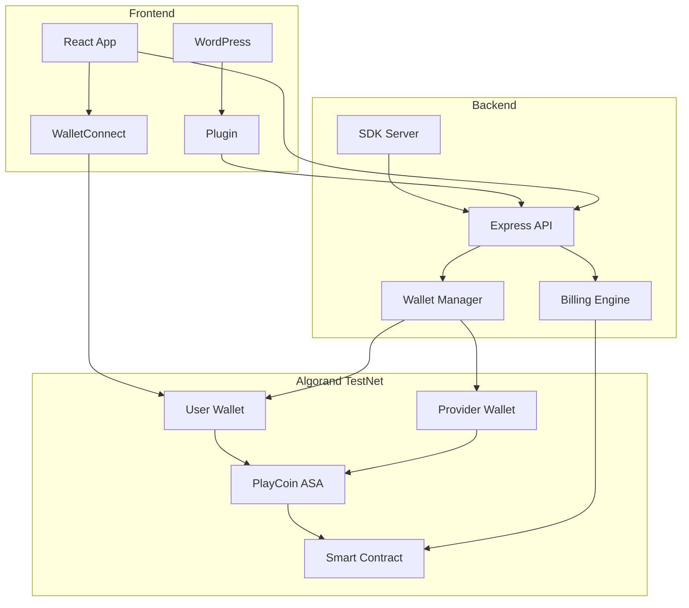
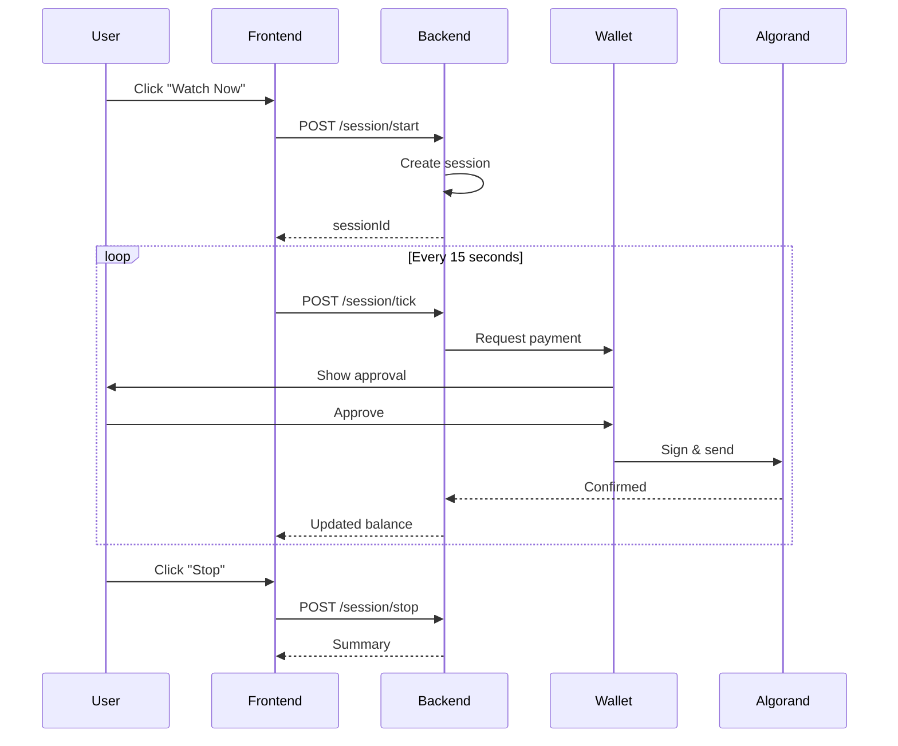
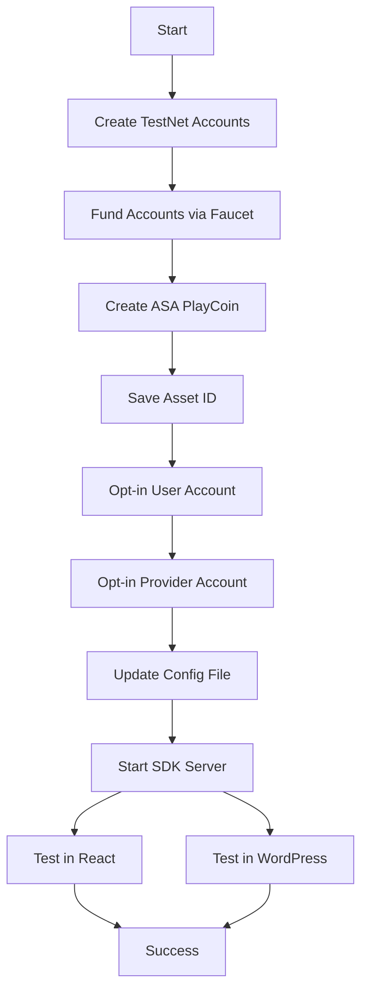
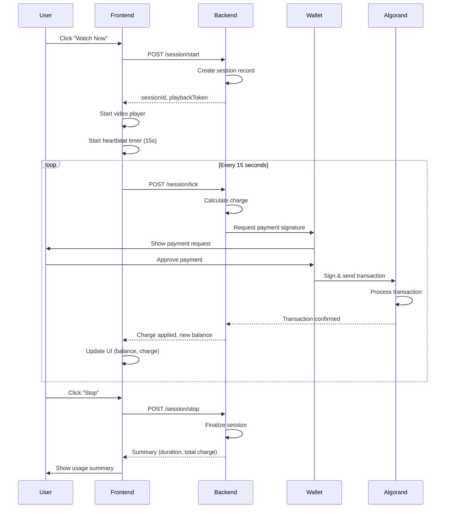
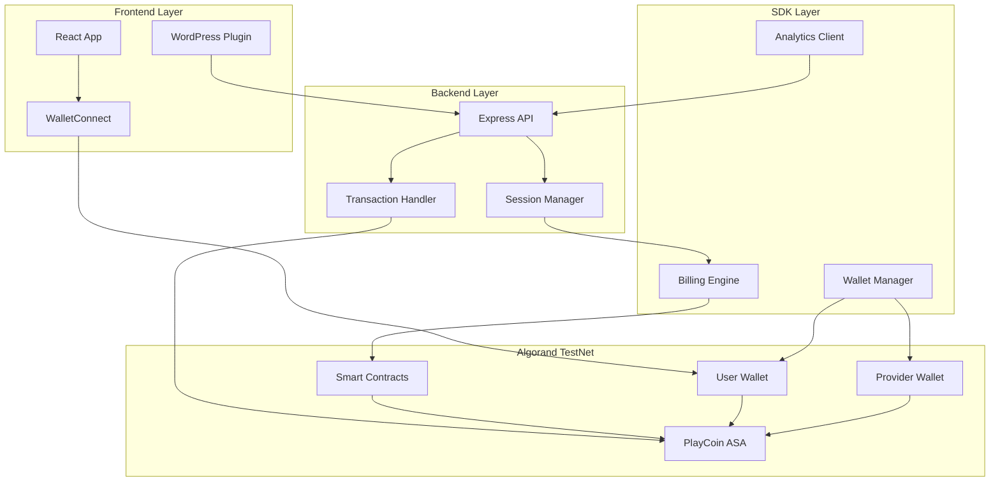

# 🚀 Play & Pay – Full Developer Onboarding (Algorand TestNet PoC)

**پروژه:** Pay as Play  
**تاریخ ایجاد:** 2025-11-04  
**آخرین به‌روزرسانی:** 2025-11-04  
**ورژن:** 1.0

---

## 📋 فهرست

- [Overview](#overview)
- [Architecture](#architecture)
- [Prerequisites](#prerequisites)
- [Step 1: Create TestNet Accounts](#step-1-create-testnet-accounts)
- [Step 2: Create ASA (PlayCoin)](#step-2-create-asa-playcoin)
- [Step 3: Opt-in (User & Provider)](#step-3-opt-in-user--provider)
- [Step 4: Configure SDK](#step-4-configure-sdk)
- [Step 5: Run SDK Server](#step-5-run-sdk-server)
- [Step 6: Test Integration](#step-6-test-integration)
- [Mermaid Flow Diagrams](#mermaid-flow-diagrams)
- [FAQ / Troubleshooting](#faq--troubleshooting)
- [Security Tips](#security-tips)

---

## 🎯 Overview

**Play & Pay** is a Pay-as-you-Use micro-payment platform built on Algorand blockchain. This guide will help you set up the complete development environment on TestNet.

### Key Components

1. **SDK (Core)**
   - Wallet management (Algorand ASA)
   - Billing engine (per-minute charges)
   - Analytics client

2. **Algorand Integration**
   - PlayCoin (PLY) ASA token
   - Smart contracts for billing
   - WalletConnect for user signatures

3. **Wallet System**
   - User-controlled wallets (Pera, MyAlgo)
   - Server-side demo mode (TestNet only)

4. **WordPress Plugin**
   - Shortcode integration
   - Real-time billing display

5. **React Components**
   - WalletWidget
   - PlayerBilling
   - UsageSummary

---

## 🏗️ Architecture

### System Architecture



### Data Flow



---

## 📦 Prerequisites

### Required Software

- **Node.js** v16+ and npm
- **Git** for cloning repositories
- **Text Editor** (VS Code recommended)
- **Browser** with Pera Wallet extension (for WalletConnect)

### Required Accounts

- **TestNet Account** with ALGO (get from faucet)
- **Email** for TestNet faucet

### Required Knowledge

- Basic JavaScript/Node.js
- Basic understanding of blockchain concepts
- Familiarity with REST APIs

---

## 📝 Step 1: Create TestNet Accounts

### Option A: Generate New Account (Recommended)

**Using Node.js:**

```bash
# Create a new file: generate-account.js
node -e "const algosdk=require('algosdk'); const acct=algosdk.generateAccount(); console.log('Address:', acct.addr); console.log('Mnemonic:', algosdk.secretKeyToMnemonic(acct.sk));"
```

**Using goal CLI:**

```bash
goal account new
```

**Save the output:**
- Address (e.g., `ABC123...`)
- Mnemonic (25 words)

### Option B: Use Algorand Faucet

1. Visit: https://bank.testnet.algorand.network/
2. Enter your email
3. Enter account address (from Option A)
4. Receive 10 ALGO (usually instant)

### Create Multiple Accounts

You need **3 accounts**:

1. **Creator Account** (for ASA creation)
   - Needs ~0.1 ALGO
   - Used once to create ASA

2. **User Account** (for testing)
   - Needs ~0.1 ALGO
   - Will opt-in to ASA
   - Will make payments

3. **Provider Account** (for receiving payments)
   - Needs ~0.1 ALGO
   - Will opt-in to ASA
   - Will receive PLY tokens

**Quick Script:**

```bash
# generate-accounts.sh
#!/bin/bash
echo "Generating 3 TestNet accounts..."

for i in {1..3}; do
  echo "Account $i:"
  node -e "const algosdk=require('algosdk'); const acct=algosdk.generateAccount(); console.log('Address:', acct.addr); console.log('Mnemonic:', algosdk.secretKeyToMnemonic(acct.sk));"
  echo "---"
done
```

**Save all mnemonics securely!**

---

## 🪙 Step 2: Create ASA (PlayCoin)

### Method 1: Using Node.js Script (Recommended)

**File:** `testnet-tools/asa-create.js`

**Steps:**

1. **Navigate to tools directory:**
   ```bash
   cd testnet-tools
   npm install algosdk dotenv
   ```

2. **Set creator mnemonic:**
   ```bash
   export CREATOR_MNEMONIC="word1 word2 ... word25"
   ```

3. **Run script:**
   ```bash
   node asa-create.js
   ```

**Expected Output:**
```
✅ Creator account loaded: ABC123...
💰 Creator balance: 10.5 ALGO
📝 Transaction params retrieved
✍️  Transaction signed
📤 Transaction sent: TXID123...
⏳ Waiting for confirmation...

🎉 ASA Created Successfully!
━━━━━━━━━━━━━━━━━━━━━━━━━━━━━━━━━━━━━━━━
Asset ID: 1234567
Unit Name: PLY
Asset Name: PlayCoin
Total Supply: 10,000,000 PLY
Decimals: 2
1 PLY = €0.01 (100 minor units = 1 PLY)
━━━━━━━━━━━━━━━━━━━━━━━━━━━━━━━━━━━━━━━━

✅ Config file updated: server/playandpay.config.json
```

4. **Save Asset ID:**
   - Copy the Asset ID (e.g., `1234567`)
   - You'll need it for opt-in and config

### Method 2: Using goal CLI

```bash
goal asset create \
  --creator $CREATOR_ADDR \
  --total 10000000 \
  --decimals 2 \
  --unitname PLY \
  --assetname "PlayCoin" \
  --url "https://playandpay.io" \
  --defaultfrozen=false \
  --note "Pay-as-you-Use micro-token"
```

### Method 3: Programmatic (Node.js)

```javascript
const algosdk = require('algosdk');

const algod = new algosdk.Algodv2('', 'https://testnet-api.algonode.cloud', '');
const creator = algosdk.mnemonicToSecretKey(process.env.CREATOR_MNEMONIC);
const params = await algod.getTransactionParams().do();

const txn = algosdk.makeAssetCreateTxnWithSuggestedParamsFromObject({
  from: creator.addr,
  total: 10_000_000,
  decimals: 2,
  defaultFrozen: false,
  unitName: "PLY",
  assetName: "PlayCoin",
  assetURL: "https://playandpay.io",
  suggestedParams: params
});

const signed = txn.signTxn(creator.sk);
const { txId } = await algod.sendRawTransaction(signed).do();
const confirmed = await algosdk.waitForConfirmation(algod, txId, 3);

console.log('Asset ID:', confirmed['asset-index']);
```

---

## ✅ Step 3: Opt-in (User & Provider)

**Why Opt-in?**
In Algorand, accounts must opt-in to an ASA before they can receive or send it.

### Method 1: Using Node.js Script

**File:** `testnet-tools/opt-in.js`

**For User Account:**
```bash
cd testnet-tools
export USER_MNEMONIC="word1 word2 ... word25"
export ASA_ID=1234567
node opt-in.js
```

**For Provider Account:**
```bash
export PROVIDER_MNEMONIC="word1 word2 ... word25"
export ASA_ID=1234567
node opt-in.js
```

**Expected Output:**
```
✅ User account loaded: XYZ789...
📦 ASA ID: 1234567
💰 Account balance: 5.2 ALGO
📝 Transaction params retrieved
✍️  Transaction signed
📤 Transaction sent: TXID456...
⏳ Waiting for confirmation...

🎉 Opt-in Successful!
━━━━━━━━━━━━━━━━━━━━━━━━━━━━━━━━━━━━━━━━
Account: XYZ789...
ASA ID: 1234567
Transaction ID: TXID456...
━━━━━━━━━━━━━━━━━━━━━━━━━━━━━━━━━━━━━━━━
```

### Method 2: Batch Opt-in Script

**File:** `optin-all.sh`

```bash
#!/bin/bash

# Set ASA ID
ASA_ID=1234567

# Opt-in user
echo "Opting in user account..."
export USER_MNEMONIC="user 25-word mnemonic"
export ASA_ID=$ASA_ID
node opt-in.js

# Opt-in provider
echo "Opting in provider account..."
export PROVIDER_MNEMONIC="provider 25-word mnemonic"
export ASA_ID=$ASA_ID
node opt-in.js

echo "✅ All accounts opted in!"
```

**Make executable:**
```bash
chmod +x optin-all.sh
./optin-all.sh
```

### Method 3: Using goal CLI

```bash
# User opt-in
goal asset optin \
  --account $USER_ADDR \
  --assetid 1234567

# Provider opt-in
goal asset optin \
  --account $PROVIDER_ADDR \
  --assetid 1234567
```

### Verify Opt-in

```javascript
const algosdk = require('algosdk');
const algod = new algosdk.Algodv2('', 'https://testnet-api.algonode.cloud', '');

const accountInfo = await algod.accountInformation(address).do();
const hasAsset = accountInfo.assets?.some(a => a['asset-id'] === asaId);

console.log('Opted in:', hasAsset);
```

---

## ⚙️ Step 4: Configure SDK

### Edit Configuration File

**File:** `server/playandpay.config.json`

```json
{
  "api_key": "YOUR_API_KEY",
  "network": "algorand-testnet",
  "asa_id": "1234567",
  "rate_per_minute": 0.02,
  "currency": "PLY",
  "auto_topup_threshold": 1.00,
  "webhook_url": "https://yourapp.com/hooks/playandpay",
  "user_mnemonic": "",
  "provider_addr": "PROVIDER_TESTNET_ADDR"
}
```

### Configuration Options

#### Option A: WalletConnect (Recommended for Production)

**Settings:**
```json
{
  "user_mnemonic": "",
  "provider_addr": "PROVIDER_TESTNET_ADDR"
}
```

**How it works:**
- User signs transactions with their wallet
- No server-side mnemonic
- More secure

#### Option B: Server-Side Mnemonic (TestNet Only)

**Settings:**
```json
{
  "user_mnemonic": "word1 word2 ... word25",
  "provider_addr": "PROVIDER_TESTNET_ADDR"
}
```

**⚠️ Warning:**
- Only for TestNet testing
- Never use in production
- Never commit to repository

### Environment Variables

**File:** `.env`

```bash
# TestNet Accounts
CREATOR_MNEMONIC="word1 word2 ... word25"
USER_MNEMONIC="word1 word2 ... word25"
PROVIDER_MNEMONIC="word1 word2 ... word25"

# ASA Configuration
ASA_ID=1234567

# API Configuration
PLAYANDPAY_API_KEY=your-api-key
PLAYANDPAY_NETWORK=testnet
```

**⚠️ Important:** Add `.env` to `.gitignore`!

---

## 🚀 Step 5: Run SDK Server

### Install Dependencies

```bash
cd playandpay-sdk
npm install
```

### Start Server

```bash
npm start
```

**Expected Output:**
```
🚀 Play and Pay SDK Server
━━━━━━━━━━━━━━━━━━━━━━━━━━━━━━━━━━━━━━━━
Server running on http://localhost:8080
Network: testnet
ASA ID: 1234567
━━━━━━━━━━━━━━━━━━━━━━━━━━━━━━━━━━━━━━━━
```

### Test Endpoints

**Start Session:**
```bash
curl -X POST http://localhost:8080/session/start \
  -H "Content-Type: application/json" \
  -d '{
    "userId": "demo-user",
    "contentId": "film123",
    "pricePerMinute": 0.02
  }'
```

**Send Tick:**
```bash
curl -X POST http://localhost:8080/session/tick \
  -H "Content-Type: application/json" \
  -d '{
    "sessionId": "session_abc123",
    "playedMs": 15000,
    "tickId": "tick_001"
  }'
```

**Stop Session:**
```bash
curl -X POST http://localhost:8080/session/stop \
  -H "Content-Type: application/json" \
  -d '{
    "sessionId": "session_abc123"
  }'
```

---

## 🧪 Step 6: Test Integration

### Test in React

**File:** `react/WalletConnectDemo.jsx`

```jsx
import WalletConnectDemo from './walletconnect-demo';

function App() {
  return (
    <WalletConnectDemo 
      asaId={1234567} 
      providerAddr="PROVIDER_TESTNET_ADDR"
      ratePerMinute={0.02}
    />
  );
}
```

**Test Flow:**
1. Click "Connect Pera Wallet"
2. Approve connection on mobile
3. Verify balance displays
4. Click "Pay €0.02 (1 min)"
5. Approve payment on mobile
6. Verify transaction on AlgoExplorer

### Test in WordPress

**Install Plugin:**
1. Download `playandpay-wordpress-addon.zip`
2. WordPress Admin → Plugins → Add New → Upload
3. Activate plugin

**Use Shortcode:**
```
[payasuse_watch price="0.02" backend="http://localhost:8080"]
```

**Test Flow:**
1. Click "Watch Now"
2. Session starts
3. Heartbeat every 15 seconds
4. Click "Stop & Pay"
5. See usage summary

### Test Flow Script

**File:** `test-flow.sh`

```bash
#!/bin/bash

echo "🧪 Testing Play and Pay SDK"
echo "━━━━━━━━━━━━━━━━━━━━━━━━━━━━━━━━━━━━━━━━"

# Test 1: Start session
echo "1. Starting session..."
SESSION_RESPONSE=$(curl -s -X POST http://localhost:8080/session/start \
  -H "Content-Type: application/json" \
  -d '{
    "userId": "test-user",
    "contentId": "test-content",
    "pricePerMinute": 0.02
  }')

SESSION_ID=$(echo $SESSION_RESPONSE | jq -r '.sessionId')
echo "✅ Session started: $SESSION_ID"

# Test 2: Send tick
echo "2. Sending tick..."
TICK_RESPONSE=$(curl -s -X POST http://localhost:8080/session/tick \
  -H "Content-Type: application/json" \
  -d "{
    \"sessionId\": \"$SESSION_ID\",
    \"playedMs\": 15000,
    \"tickId\": \"tick_001\"
  }")
echo "✅ Tick sent"

# Test 3: Stop session
echo "3. Stopping session..."
STOP_RESPONSE=$(curl -s -X POST http://localhost:8080/session/stop \
  -H "Content-Type: application/json" \
  -d "{
    \"sessionId\": \"$SESSION_ID\"
  }")
echo "✅ Session stopped"

echo "━━━━━━━━━━━━━━━━━━━━━━━━━━━━━━━━━━━━━━━━"
echo "🎉 All tests passed!"
```

**Run:**
```bash
chmod +x test-flow.sh
./test-flow.sh
```

---

## 📊 Mermaid Flow Diagrams

### Complete Setup Flow



### Session Flow



### Architecture Map



---

## ❓ FAQ / Troubleshooting

### Q: "Account not opted in" error

**A:** Run opt-in script:
```bash
USER_MNEMONIC="..." ASA_ID=1234567 node opt-in.js
```

**Verify:**
```javascript
const accountInfo = await algod.accountInformation(address).do();
const hasAsset = accountInfo.assets?.some(a => a['asset-id'] === asaId);
console.log('Opted in:', hasAsset);
```

---

### Q: "Insufficient balance" error

**A:** 
1. Get TestNet ALGO from faucet: https://bank.testnet.algorand.network/
2. Check balance:
   ```bash
   goal account balance -a $ACCOUNT_ADDR
   ```
3. Minimum: 0.1 ALGO for transactions

---

### Q: "Transaction failed" error

**Possible Causes:**
1. **Insufficient balance** → Fund account
2. **Not opted in** → Run opt-in script
3. **Wrong ASA ID** → Check config file
4. **Network issue** → Check internet connection

**Debug:**
```javascript
try {
  const { txId } = await algod.sendRawTransaction(signed).do();
  console.log('Transaction sent:', txId);
  
  const confirmed = await algosdk.waitForConfirmation(algod, txId, 3);
  console.log('Confirmed:', confirmed);
} catch (error) {
  console.error('Error:', error.message);
  if (error.response) {
    console.error('Response:', error.response.body);
  }
}
```

---

### Q: "ASA creation failed"

**Possible Causes:**
1. **Insufficient balance** → Need ~0.1 ALGO
2. **Invalid mnemonic** → Check mnemonic format
3. **Network issue** → Check TestNet connectivity

**Verify:**
```bash
# Check account balance
goal account balance -a $CREATOR_ADDR

# Check mnemonic
goal account import -m "your mnemonic"
```

---

### Q: How to check transaction on AlgoExplorer?

**A:**
1. Get transaction ID from logs
2. Visit: https://testnet.explorer.algorand.org/
3. Search for transaction ID
4. Verify status and details

---

### Q: WalletConnect not connecting

**A:**
1. Check Pera Wallet is installed
2. Check network is TestNet
3. Check account is opted in
4. Check browser console for errors

---

### Q: Server not starting

**A:**
1. Check Node.js version: `node --version` (should be v16+)
2. Check dependencies: `npm install`
3. Check config file: `server/playandpay.config.json`
4. Check port 8080 is available

---

## 🔒 Security Tips

### ⚠️ Critical Security Rules

1. **TestNet Only**
   - ✅ Use TestNet accounts only
   - ❌ Never use mainnet mnemonics
   - ❌ Never commit real keys

2. **Environment Variables**
   - ✅ Store mnemonics in `.env`
   - ✅ Add `.env` to `.gitignore`
   - ❌ Never commit `.env` files
   - ❌ Never hardcode mnemonics

3. **Production Changes**
   - ✅ Use WalletConnect (user signs)
   - ✅ No server-side mnemonics
   - ✅ Environment variables in secrets manager
   - ✅ HTTPS only
   - ✅ Rate limiting

### .gitignore Template

```gitignore
# Environment variables
.env
.env.local
.env.*.local
*.env

# Mnemonics and keys
*.key
*.mnemonic
secrets/
keys/

# Node modules
node_modules/

# Logs
*.log
logs/

# Build outputs
dist/
build/
```

---

## 📚 Related Documentation

- **Developer Guide:** [`DEVELOPER_GUIDE.md`](./DEVELOPER_GUIDE.md)
- **TestNet Tools README:** [`README.md`](./README.md)
- **Flow Diagrams:** [`flow-diagram.md`](./flow-diagram.md)
- **Security Best Practices:** [`../security-best-practices.md`](../security-best-practices.md)
- **SDK Structure:** [`../sdk-structure.md`](../sdk-structure.md)

---

## 🔄 به‌روزرسانی‌ها

**2025-11-04 - ورژن 1.0:**
- ایجاد فایل اولیه
- مستندسازی Overview
- مستندسازی Architecture
- مستندسازی Prerequisites
- مستندسازی Step-by-Step Setup
- مستندسازی Mermaid Flow Diagrams
- مستندسازی FAQ / Troubleshooting
- مستندسازی Security Tips

---

**تاریخ آخرین به‌روزرسانی:** 2025-11-04  
**ورژن فعلی:** 1.0

